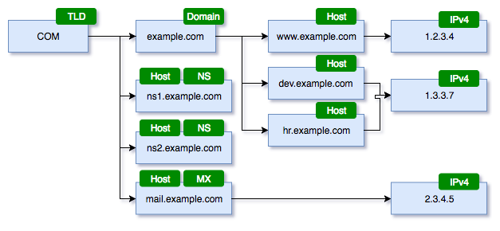

# Reason to Exist

DNS is a source of rich data about the Internet in general and organizations in specific. This data can be leveraged for a number of security use-cases that can be solved through enumeration, filtering and correlation of DNS data.

The DNS information can be represented in a labelled graph such as below

This information can easily be used to query information about an organization, having a set of domains and how they are interconnected to each other. For example, we can identify many domains owned by an organization by correlating its corporate web domain's *Nameserver* to other domains using the same *Nameserver*. This correlation involves basic graph traversal algorithms that are easily available through a *Graph Database*.

Combined with the [Forward DNS Dataset](https://opendata.rapid7.com/sonar.fdns_v2/), we can build an extensive research and development tool chain for mining useful information from Internet wide DNS records.

